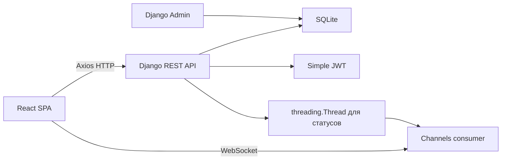

# Архитектура проекта

## Компоненты

## Общая схема

Проект состоит из backend на Django REST Framework и frontend на React. React отвечает за интерфейс, корзину в `localStorage`, клиентскую валидацию форм и подключение к WebSocket заказа. Backend отвечает за данные, JWT-аутентификацию, расчет суммы заказа, условную оплату и real-time рассылку статусов заказа. Для локального запуска WebSocket используется Daphne как ASGI runtime для Channels.

Внешние очереди не используются. После `POST /api/orders/{id}/pay/` backend меняет заказ на `paid`, отправляет WebSocket-сообщение и запускает `threading.Thread`, который последовательно переводит заказ в `cooking`, `baking`, `delivering`, `completed`.

## Django-приложения

`users` содержит расширенную модель пользователя на базе `AbstractUser`, регистрацию, логин через Simple JWT, refresh token и профиль.

`pizzeria` содержит категории, пиццы, заказы, позиции заказа, отзывы, избранное, REST API, permissions, WebSocket consumer и demo seed command.

## Роли доступа

| Роль | Возможности |
| --- | --- |
| Гость | Каталог, категории, детали пиццы, поиск по `title`, фильтрация, пагинация, просмотр отзывов. |
| Авторизованный пользователь | Все возможности гостя, заказ, условная оплата, свои заказы, избранное, отзывы, профиль. |
| Администратор | CRUD для `Category` и `Pizza` через API, управление всеми сущностями через Django Admin. |

## Ограничения

Используется SQLite. Docker, Redis, Celery, PostgreSQL, Redux, React Query, Tailwind и backend-модель корзины не используются.
