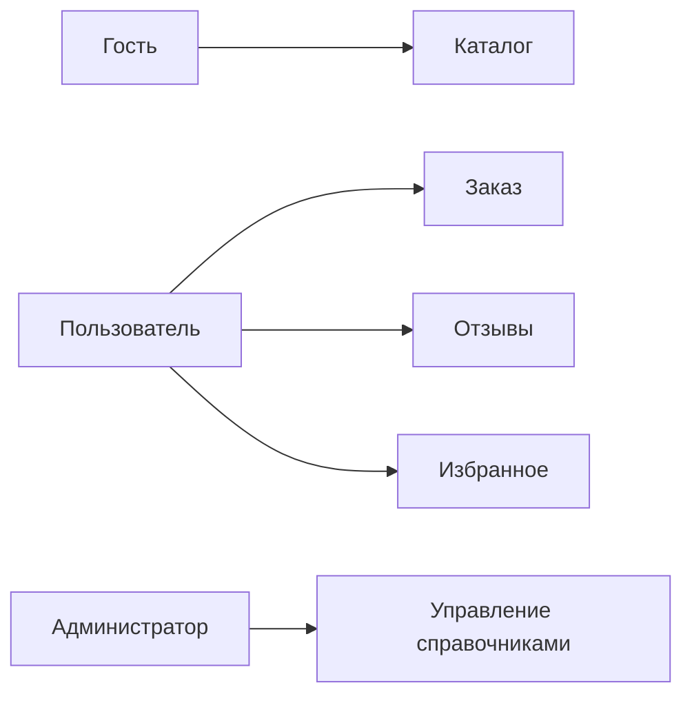
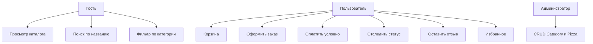
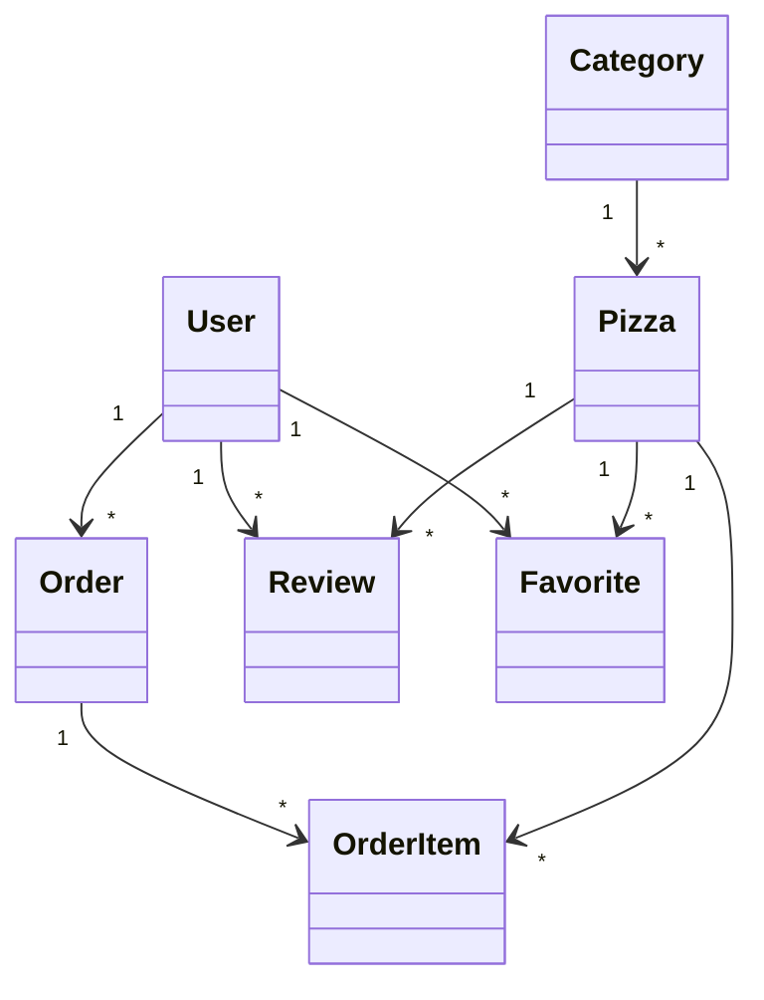
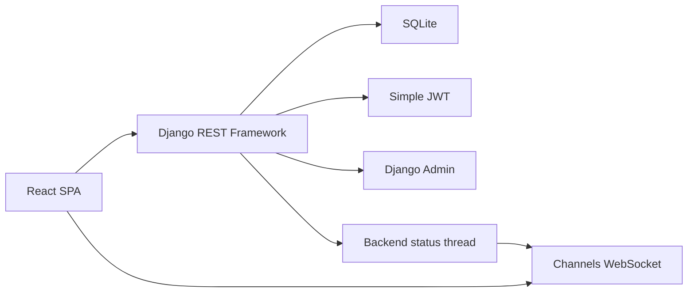
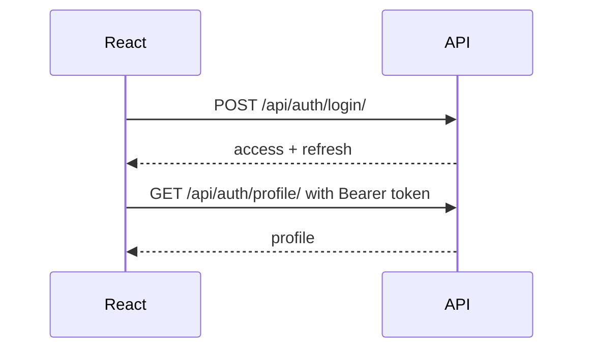
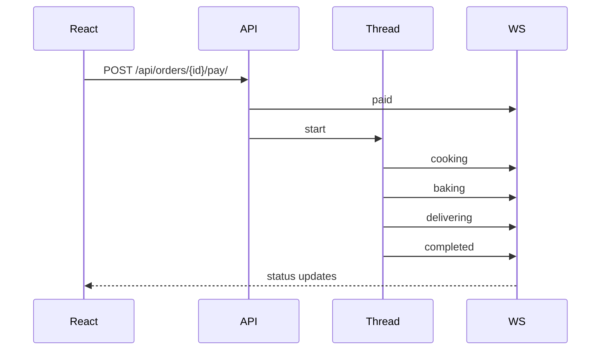

# Диаграммы

## Бизнес-контекст

## Use Case

## Концептуальная модель классов

## Компоненты

## JWT

## WebSocket status

## Примечания

Нормализация БД не выполняется по уточненному требованию. Docker не используется. Используется SQLite. В backend ровно два приложения: `users` и `pizzeria`. Модель пользователя расширенная. API использует JWT. Доступ разделен на гостя, авторизованного пользователя и администратора.
