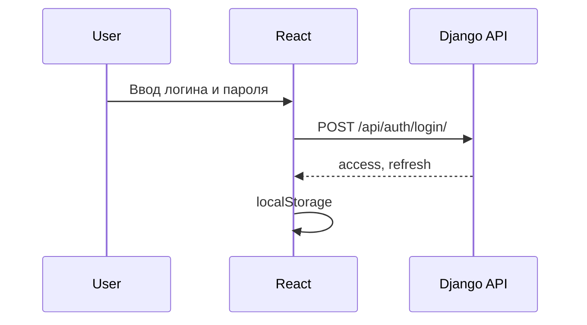

# JWT scheme

## Получение токенов

1. Пользователь отправляет логин и пароль на `POST /api/auth/login/`.
2. Backend возвращает `access` и `refresh`.
3. React сохраняет токены в `localStorage`.



## Использование access token

Axios interceptor добавляет заголовок:

```http
Authorization: Bearer <access_token>
```

Так выполняются запросы к профилю, заказам, избранному и созданию отзывов.

## Обновление access token

Refresh token отправляется на `POST /api/auth/token/refresh/`. В текущем MVP endpoint есть на backend и описан в API, а автоматический refresh в Axios можно добавить как небольшое расширение.

## Ограничения

WebSocket-аутентификация намеренно не усложняется. Заказ создается через защищенный REST API, а WebSocket подключается к конкретному `order_id` для учебной демонстрации статуса.
