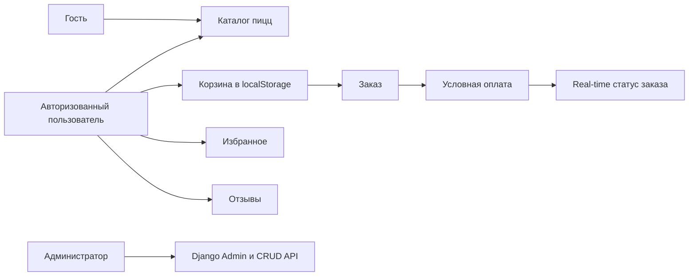
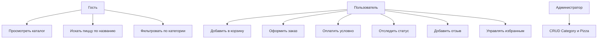
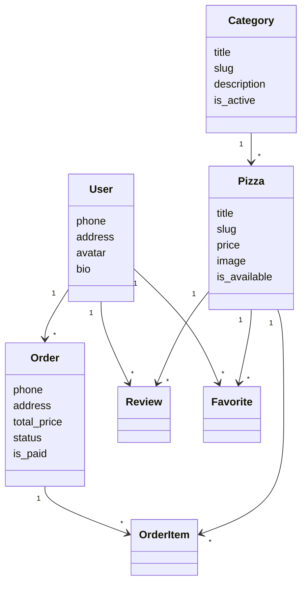

# Этап 0. Отчет по проекту PizzaHouse

## Паспорт проекта

**Название:** PizzaHouse: веб-приложение пиццерии с каталогом, корзиной и заказами.

**Предметная область:** кулинария.

**Основная сущность:** `Pizza`.

**Категория:** `Category`.

**Цель:** создать учебное веб-приложение, в котором пользователь просматривает каталог пицц, ищет пиццу по названию, фильтрует по категории, добавляет позиции в корзину, оформляет заказ, условно оплачивает его и видит real-time изменение статуса через WebSocket.

## Бизнес-контекст

## Бизнес-глоссарий

| Термин | Описание |
| --- | --- |
| Пицца | Товар каталога, который можно просмотреть и добавить в корзину. |
| Категория | Справочник для группировки пицц. |
| Корзина | Клиентское состояние React, сохраняемое в `localStorage`. Backend не хранит модель корзины. |
| Заказ | Результат оформления корзины авторизованным пользователем. |
| Условная оплата | Учебное действие одной кнопкой без банковского эквайринга. |
| Отзыв | Комментарий и рейтинг пиццы от авторизованного пользователя. |
| Избранное | Список понравившихся пицц пользователя. |

## Матрица стейкхолдеров

| Стейкхолдер | Интерес | Роль в системе |
| --- | --- | --- |
| Гость | Быстро изучить меню | Просмотр каталога, поиск, фильтрация |
| Пользователь | Оформить заказ и отслеживать статус | Заказы, отзывы, избранное, профиль |
| Администратор | Управлять справочниками и заказами | Django Admin, CRUD API |
| Преподаватель | Проверить соответствие траектории В | Оценивает REST, React, JWT, WebSocket, документацию |

## SWOT-анализ

| Сторона | Описание |
| --- | --- |
| Strengths | Простая архитектура, понятный стек, быстрый запуск на Windows. |
| Weaknesses | Нет настоящей оплаты, складского учета и сложной аналитики. |
| Opportunities | Можно расширить каталог, добавить реальные изображения и улучшить кабинет пользователя. |
| Threats | InMemoryChannelLayer подходит для учебной демонстрации, но не для масштабирования. |

## Use Case

## Концептуальная модель классов

## Спецификация инцидентов

| Инцидент | Реакция системы |
| --- | --- |
| Пользователь оформляет пустую корзину | React показывает ошибку, backend также проверяет список позиций. |
| Пользователь не авторизован | Защищенный REST API возвращает 401, React перенаправляет на вход. |
| Повторная оплата заказа | Backend возвращает текущий заказ без повторного запуска сценария. |
| WebSocket подключился после оплаты | Клиент получает последующие статусы; текущий статус загружается через REST. |
| Неверная оценка отзыва | Клиент и backend ограничивают рейтинг диапазоном 1-5. |

## Ограничения проекта

Нормализация БД отдельно не выполняется по уточненному требованию. Docker, PostgreSQL, Redis, Celery и внешние очереди не используются. База данных - SQLite. В проекте ровно два основных Django-приложения: `users` и `pizzeria`.
