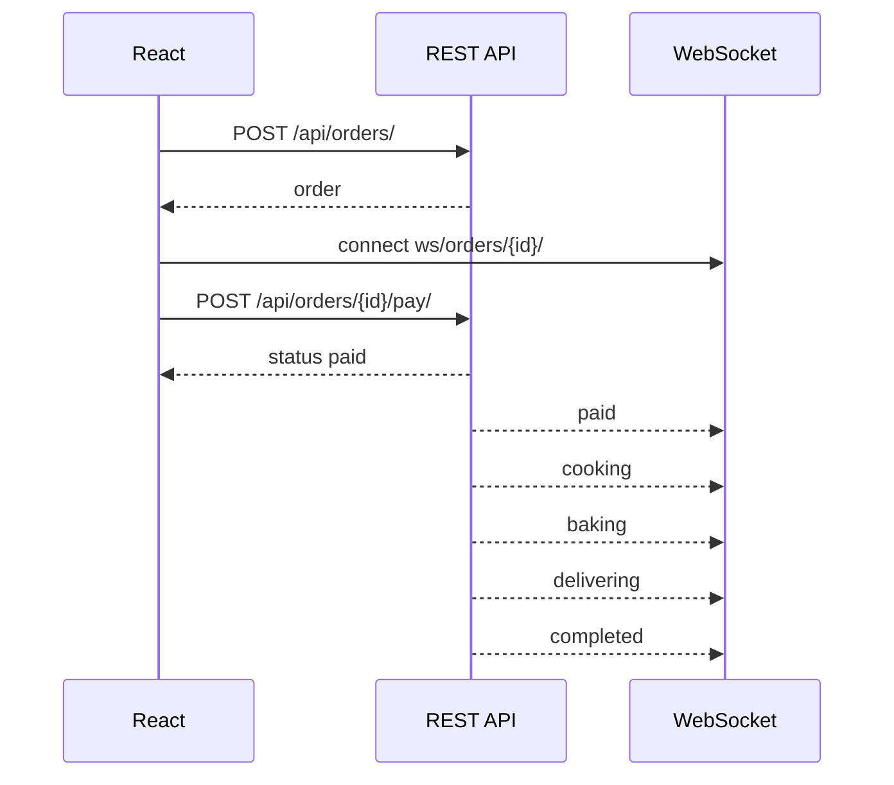

# Взаимодействие UI и API

React SPA обращается к Django REST API через Axios. Запросы выполняются в формате AJAX/fetch через HTTP, без перезагрузки страницы.

JWT access token хранится в `localStorage` и передается в заголовке `Authorization: Bearer <token>`. Refresh token также хранится в `localStorage` и используется endpoint `/api/auth/token/refresh/`.

Корзина хранится на клиенте в `localStorage`. Backend не имеет модели `CartItem` и получает содержимое корзины только в момент оформления заказа через `POST /api/orders/`.

После создания заказа React открывает страницу заказа. Пользователь нажимает "Оплатить условно", React отправляет `POST /api/orders/{id}/pay/`. Backend меняет статус, запускает фоновый поток и отправляет WebSocket-сообщения. React не использует `setTimeout` для смены статусов и только обновляет UI по данным backend.

